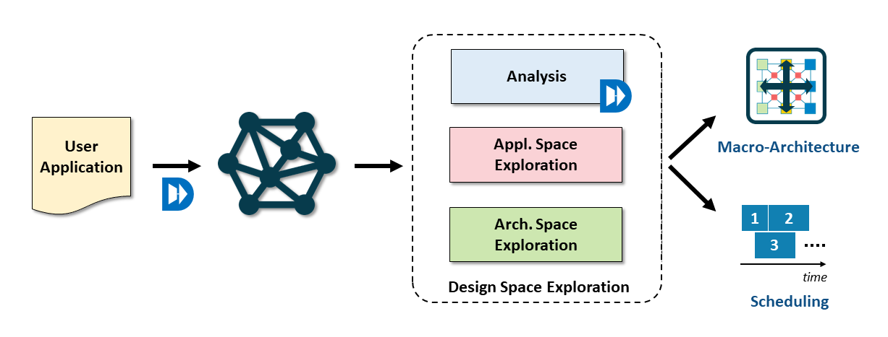

This repository contains a framework for building Application Specific Architecture.

Starting from a user-provided application, the framework will analyze it, and perform
a _Design Space Exploration_ phase. The goal of this exploration is to return a (or a set of) macro-level architecture descriptions of a System on Chip (SoC) able to
execute the application, resulting in good performance/power/area trade-offs.

The macro architectural description considers, among the others, the number of processing elements, the 
on-chip buffer space, and a schedule of the application on the resulting SoC.


This project depends on DaCe (for frontend and data analysis) and Streaming-Sched (for scheduling).


_Note_: this is a work-in-progress project.

For the development guide please refer to the wiki.


## Requirements
The framework has been tested with Python 3.8.

When cloning this repository, be sure to initialize all the submodules

```
git clone --recursive https://github.com/spcl/ASA.git
```


Then we need to install the requirements, DaCe, and properly set the Python PATH:

```
pip install -r requirements.txt
pip install --editable dace/
export PYTHONPATH=$(pwd):$(pwd)/streamingsched
```

### When using with ML based samples

DaCeML currently only support Python3.8.
When using with ML based samples, DaCeML requires a specific version of DaCe:

```
pip install --editable daceml/
cd dace/
git checkout v0133_and_inline_pass 
cd -

```

*Important*: with the other samples, use the latest DaCe master or the specific commit of this repository submodules.

_Note_: as this is currently development, an automated environment setup will be provided later.


## Usage

The tool flow is shown in the following figure:




The input is a user-provided application that will be parsed using DaCe and represented in its intermediate representation (Stateful DataFlow Graph - SDFG). The user application must respect certain requirements (see later section).

This will enter a Design Space Exploration phase where we evaluate:
- different ways of representing the application (Application Space Exploration): the same application can be implemented in multiple ways. Let's consider the case of a Matrix-Matrix multiplication. This can be implemented by resorting to matrix-vector multiplications, outer products, and other basic operations. Similarly, it may read/produce data in a row or column major formats. The goal of this phase is to generate different (but semantically equivalent) representations of the user-provided applications that may result in different running times, parallelism opportunities, and on-chip buffer space requirements. In this stage, starting from the user-provided SDFG, the framework generates multiple _Canonical SDFGs_. Please refer to the development guide in the wiki for a more detailed
definition.
- different architectures (Architecture Space Exploration). This currently takes into consideration two main aspects:
  - number of processing elements (PEs): architectures comprising a different number of PEs will be considered (user-defined).
  - on-chip memory space: on-chip memory can be used to store data that will be re-used later on in the computation. The larger the on-chip memory, the lower the off-chip accesses but the higher the area that will be used to implement it. Here we want to explore this trade-off by considering several on-chip memory sizes (user-defined).


Let's consider the following simple example (you can find the full program under `samples/simple/simple_1.py`).

The user-provided application is a DaCe program that computes the matrix multiplication between two $8\times 8$ input matrices `A` and `B`

```Python
@dace.program
def simple_1(A: dace.float32[8, 8], B: dace.float32[8, 8]):
    return A @ B
```

To perform Design Space Exploration we have to parse it using DaCe, and then call the `DSE` function:

```Python
from dse.dse import DSE
# Get the SDFG
sdfg = simple_1.to_sdfg()
    
# Perform Design Space Exploration
results = DSE(
    sdfg,
    num_pes=[8, 16, 32, 64],  # List of allowed number of PEs 
    on_chip_memory_sizes=[32, 128]  # List of allowed on-chip-memory size
)
```

By default, the framework returns all the evaluated configurations (Application Variations, Number of PEs, On-Chip memory area ...), together with
synthetics score for their Power consumption, expected Performance and Area consumption (PPA).

As the typical objective is to minimize all of them, we can analyze the return results and save the Pareto frontier points into a file for successive analysis.

```Python

from dse.analysis import get_pareto_configurations
get_pareto_configurations(results, "my_program")
```


While invoking DSE other arguments can be specified:
- whether or not to use multithreading (`use_multithreading`, set to `False` by default) and, in case, the number of threads to use (`n_threads`, 8 by default). This is useful to reduce DSE times when dealing with non-trivial computations
- unrolling factor: for iterated algorithms, where the computation is repeated multiple times but on different _independent_ input data, working on the fully unrolled SDFG may be expensive and unnecessary (the computation is the same). In this case, we allow partial unrolling: the computation is unrolled a certain amount of times, as defined by the argument. In this way, the SDFG will be smaller than the fully unrolled one (we save analysis time), but we can still exploit the parallelism given by the independent sub-computations. See `sample/simple/simple_iterated.py` for an example.


### Application Requirements
To process a given user application, the DSE phase needs that the user input respects the following constraint:
- the resulting user application SDFG is comprised of a single state, with library nodes and access nodes. Maps are allowed only as top-level scope (in the case of iterated computation)
- Each library node can be expanded using a canonical expression
- at the time of DSE, the SDFG must not have symbolic expressions. So symbols must be explicitly specialized.

The samples provided with this repository and (many of) DaCeML-generated SDFGs respect these requirements.  

Please refer to the development wiki for additional details. 
## Samples and tests

This repository provides samples (under the `sample/` folder) to illustrate the framework API,  and unit tests (under the `tests/` folder) to test basic functionalities.

